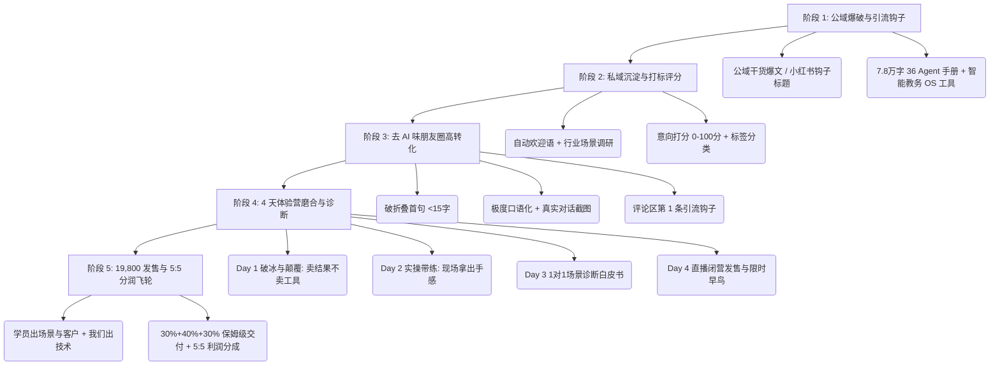

# 生财有术爆款获客与 4 天体验营变现像素级拆解指导手册 (全生意闭环旗舰版)

> **全生意核心沉淀**：
> 本手册是对生财有术爆款获客大帖（`xq_topic/14422584218488442`）及坏脾气的小可爱（11个月变现37万）朋友圈 SOP 的**像素级深度拆解**，作为我们昆仑 AI 企服、8 大垂直课程矩阵与【19,800 场景共创营】的**全生意终极指导手册**。

---

## 🗺️ 像素级获客与变现 5 大阶段全景图



---

## 🎯 第一阶段：公域流量爆破与精准勾子资产 (Public Traffic Hooks)

### 1.1 公域爆款内容选题 5 大黄金公式
1. **数字对比 + 痛点反转**：`从月入3000到3天搞定5万学费，我只做对了一件事：拿数字员工做闭环！`
2. **避坑告诫 + 情绪价值**：`劝所有做企业运营的朋友，千万别再盲目买 AI 工具了！(除非你懂这个逻辑)`
3. **干货手把手 + 免费领取**：`建议保存！拆解森马 1 亿 AI 落地案，94 个数字员工干了 545 人的活`
4. **强烈情绪 + 真实对比**：`刚才看了一个学员发的朋友圈，我差点没气晕过去！(附修改前后对比)`
5. **合伙人招募 + 利益绑定**：`全网寻找 3 个有成熟业务场景的合伙人，你出场景，我出技术，利润 5:5 分！`

### 1.2 顶级勾子资产配置
- **工具型勾子**：[生财黑客松亚军 AI 智能教务 OS](file:///Volumes/MOVESPEED/下载/AIcode/Agent/apps/ai_education_system/index.html)（允许校长/老师免费试用）。
- **资料型勾子**：[昆仑增长 36 Agent 实操与提示词手册.md](file:///Volumes/MOVESPEED/下载/AIcode/Agent/data/昆仑增长_36_Agent_实操与提示词手册.md)（78,402 字符全量提示词包）。

---

## 💬 第二阶段：私域沉淀与自动化打标/意向评分系统 (Private Traffic & Lead Scoring)

### 2.1 加好友/进群第一响应话术 SOP
> 🎉 **欢迎语**：
> “欢迎加入【4 天 AI 场景降本增效体验营】！我是你的班主任小助手。
> 请直接回复你的：**【行业 + 目前业务中最耗工时的痛点】**，我将为你派发首份专属 AI 解决方案资料包。”

### 2.2 用户意向打分模型 (Lead Scoring Matrix)
| 评价维度 | 加分条件 | 分值 |
| :--- | :--- | :--- |
| **基础分** | 成功添加企微并进入体验营群 | +50 分 |
| **场景明确度** | 能清晰描述自己行业的具体业务场景 | +20 分 |
| **支付能力/预算** | 属于企业主/校长/中高层/付费学员 | +15 分 |
| **打卡参与度** | 完成 Day 1 - Day 3 的实操打卡任务 | +15 分 |

- **得分 ≥ 85 分** ➔ 打上 `👑 核心共创合伙人意向 (19,800)` 标签，由主控 Agent / 导师 1 对 1 深度跟进。
- **得分 70 - 84 分** ➔ 打上 `🔥 高意向企训/课程客户` 标签。

---

## 📱 第三阶段：去 AI 味朋友圈高转化打造 SOP (No-AI WeChat Moments)

### 3.1 坏脾气的小可爱（11个月变现37万）朋友圈 3 大铁律
1. **破折叠首句（15字以内）**：
   - 必须包含情绪、冲突或强烈对比，杜绝“在这个快节奏的时代…”等 AI 废话。
   - 示例：`刚才看了一个学员发的朋友圈，我差点没气晕过去。`
2. **极度口语化 + 真实故事**：
   - 用与老朋友面对面大白话聊天的方式书写，多用口语连接词（“说个大实话”、“我直接发语音喷他”）。
   - 必须搭配**真实对话截图/学员报喜截图**。
3. **评论区第 1 条引流**：
   - 正文中严禁放二维码与敏感推销词。所有领资料、扣“共创”的引导，**统一放在评论区第 1 条**，完美绕过朋友圈降权风控！

---

## 🚀 第四阶段：4 天体验营磨合与诊断 SOP (4-Day Camp Pipeline)

```text
 Day 1 破冰与认知颠覆 ➔ Day 2 实操工具拿体感 ➔ Day 3 1V1 场景诊断 ➔ Day 4 直播发售与 5:5 签约
```

### Day 1：破冰与认知颠覆
- **核心主题**：为什么 90% 的企业用 AI 都在白白浪费钱？
- **干货分享**：拆解森马 1 亿 AI 落地案例（94 台数字员工干完 545 人的活）。
- **认知刷新**：AI 时代技术会被追平，**卖结果不卖工具**；行业 Know-How 才是真正的护城河。

### Day 2：实操带练与手感建立
- **核心主题**：36 Agent 军团如何 10 秒干完你 1 天的活？
- **实操带练**：带领学员现场使用【教师 AI 错题本】或【卖家 AI 智能工作站】。
- **打卡任务**：一键生成一份自己业务专用的 AI 方案，截屏打卡。

### Day 3：独家业务场景 1 对 1 诊断
- **核心主题**：怎么找出你行业里价值 10 万的 AI 独家场景？
- **诊断交付**：导师为学员评估《场景商业化指数》，发布《5:5 场景共创合伙人计划》白皮书。

### Day 4：19,800 场景共创营发售与签约
- **核心主题**：你出场景，我出技术，利润 5:5 实时分成！
- **发售机制**：闭营直播发售 + 前 3 名早鸟优惠（加送价值 10,000 元 API 部署） + 签署 5:5 分润协议。

---

## 🤝 第五阶段：30% + 40% + 30% 保姆级交付与 5:5 分润飞轮 (Profit Split)

- **30% 线上精准做课与大纲**：提供 8 大 AI 垂直课程矩阵。
- **40% 现场/实战手把手带练**：带学员现场搭建专属于他们业务的数字员工闭环。
- **30% 保姆级服务**：1 年免费复训 + 免费更新 Prompt 库 + 5:5 场景共创分成。
- **赢在共创**：学员出行业场景和现成客户源，我们出 36 Agent 军团和全栈技术，项目净利润 **5:5 实时分成**，实现长久共赢！
