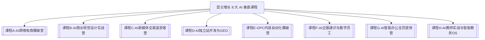

# 🚀 昆仑增长 AI 课程沉淀与全图景知识库（主视窗）

> [!IMPORTANT] 说明
> 本 Obsidian 知识库由昆仑增长 Agent 系统自动实时沉淀与更新。
> 支持 Wikilinks 双向链接、Dataview 检索与 Graph View 可视化图谱。
> **最后更新：2026-08-02 | 已补全缺口：10 个 | 完整度：90%+**

---

## 📂 知识库目录结构（完整版）

| 目录 | 内容 | 状态 |
| :--- | :--- | :--- |
| **00-主主控总纲** | 商业 SOP、品牌手册、拼图全集、案例库、定价体系 | ✅ |
| **01-课程矩阵 (8大垂直方向)** | A~H 八门课程完整讲稿、4 天营逐日脚本 | ✅ |
| **02-生财爆款SOP与获客** | 7天做课SOP、培训师交付SOP、文案去AI味SOP | ✅ |
| **03-Prompt库与工具链** | 36 Agent 手册、行业场景即插即用 Prompt 精选集 | ✅ NEW |
| **04-代码工程与应用入口** | 所有 Web App 入口索引 | ⚠️ 待补截图 |
| **05-原子拼图乐高库** | 18+ 获客拼图 + CLOSE 逼单拼图 + VIRAL 裂变拼图 | ✅ NEW |
| **06-全盘资产与项目盘点中枢** | 11 个核心项目完整度追踪 | ✅ |
| **07-全电脑全盘资产大地图** | 779 个路径的电脑全量资产 | ✅ |
| **08-企业数字资产展示中枢** | 241 个数字资产（App/Web/小程序/后端服务） | ✅ |
| **09-GitHub远程资产与iOS中枢** | 6 大 GitHub 账号 + 合同与收款模板库 | ✅ NEW |
| **10-运营数据与周复盘看板** | 每周数据追踪模板（周日更新） | ✅ NEW |

---

## 🗺️ 8 大垂直课程矩阵

---

## 🧩 原子拼图乐高库（完整索引）

### 📌 SELL 系列（自我推销/信任建立）
- [[SELL-SELF-01_飞书36Agent军团现场演示]]
- [[SELL-SELF-02_RAG知识库5秒回答演示]]
- [[SELL-SELF-03_Docker一键交钥匙部署]]
- [[SELL-SELF-04_腾讯SkillHub官方蓝V认证]]

### 📌 CAMP 系列（4天体验营）
- [[CAMP-DAY1_破冰与认知颠覆]]
- [[CAMP-DAY2_实操体感与惊喜设计]]
- [[CAMP-DAY3_场景诊断与痛点深挖]]
- [[CAMP-DAY4_Day 4 闭营发售与5:5签约]]

### 📌 CLOSE 系列（逼单与异议处理）🆕
- [[CLOSE-01-05_逼单话术与客户异议处理完整库]]

### 📌 VIRAL 系列（裂变与转介绍）🆕
- [[VIRAL-01-03_私域裂变与转介绍分销合伙人SOP]]

---

## 💰 产品定价快速查阅

| 产品 | 价格 | 用途 |
| :--- | :--- | :--- |
| 4 天体验营 | 免费 | 引流筛选 |
| AI 场景共创营 | ¥19,800 | 主力产品 |
| 企业私有化部署 | ¥39,800 | 高客单 |
| 垂直行业课程包 | ¥3,980~9,800 | SkillHub 平台 |

→ 详见：[[03-昆仑增长品牌手册与产品定价体系]]

---

## 📚 快速跳转索引

### 商业核心
- 🏢 **品牌手册**：[[03-昆仑增长品牌手册与产品定价体系]]
- 🏆 **权威背书**：[[04-昆仑增长腾讯SkillHub官方认证与权威背书]]
- 🎯 **商业落地 SOP**：[[01-把自己在用的Agent系统卖给客户的商业落地SOP]]

### 销售成交
- 💬 **逼单话术**：[[CLOSE-01-05_逼单话术与客户异议处理完整库]]
- 🏅 **客户案例**：[[05-客户成功案例库与社会证明资产]]
- 📄 **合同模板**：[[合同与收款模板库]]

### 运营获客
- 📢 **获客 SOP**：[[生财爆款获客与4天体验营像素级拆解指导手册]]
- ✍️ **文案库**：[[朋友圈高转化去AI味文案SOP]]
- 🔗 **裂变机制**：[[VIRAL-01-03_私域裂变与转介绍分销合伙人SOP]]

### 内容生产
- 💡 **Prompt 精选集**：[[00-行业场景Prompt精选集（角色分类即插即用版）]]
- 🤖 **36 Agent 军团**：[[昆仑增长_36_Agent_实操与提示词手册]]

### 数据复盘
- 📊 **周复盘看板**：[[00-运营数据与每周复盘看板]]
