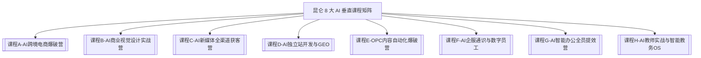

# 🚀 昆仑 AI 课程沉淀与全图景知识库 (Obsidian 双向链接版)

> [!IMPORTANT] 说明
> 本 Obsidian 知识库由 Agent 系统自动实时沉淀与更新。支持 Wikilinks 标签导航、Dataview 检索与可视化图谱（Graph View）。

## 🗺️ 8 大垂直课程矩阵概览

## 📚 快速双向链接跳转

- 📋 **商业总纲**：[[00-昆仑增长商业总纲v6.0]]
- 🎯 **获客 SOP**：[[02-生财爆款4天体验营全流程SOP]]
- 🤖 **Agent 军团**：[[03-36_Agent军团实操与提示词手册]]
- 💻 **Web 系统**：
  - [[课程A-卖家智能工作站]] (apps/ai_crossborder_ecommerce)
  - [[课程H-智能教务OS系统]] (apps/ai_education_system)
