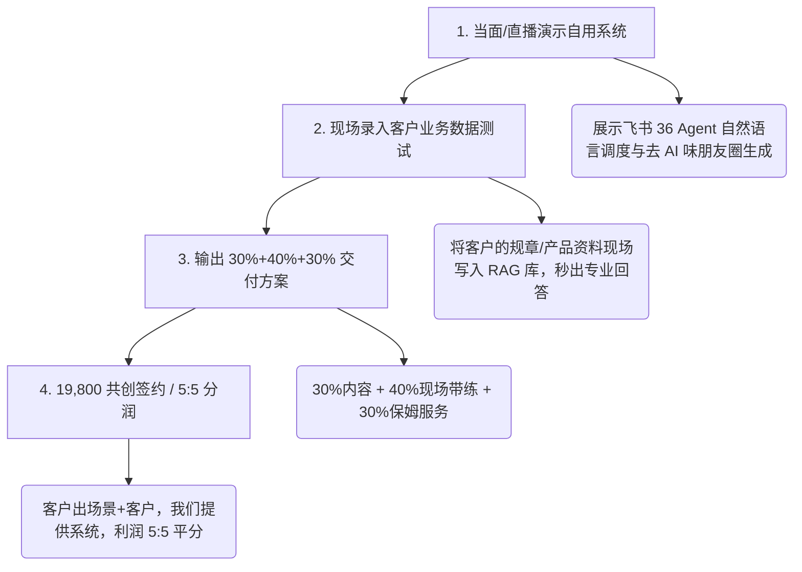

# 🚀 商业大招：把自己在用的 Agent 系统卖给客户的完整 SOP

> [!IMPORTANT] 核心商业判断 (Sell What You Use)
> **客户绝对不为单纯的软件付费，客户只为“正在跑通且产生结果的系统”付费！**
> 我们不卖未经验证的理想化工具。我们直接把**我们自己每天在用的 36 Agent 集群、飞书网关、RAG 向量库与 8 大 Web 工作站**全量复刻私有化部署给客户！

---

## 💡 为什么“卖自用系统”成交率高达 80%？

1. **零信任成本**：直接当面展示我们后台真实运行的飞书机器人、实时检索的 30 万字知识库与自动生成去 AI 味朋友圈的过程。客户亲眼看到“真东西”。
2. **卖结果不卖工具**：结合森马渊虹案例（94 台数字员工干完 545 人的活），告诉客户：我们卖给你的不是代码，而是**已经跑通的数字员工岗与商业闭环**。
3. **开箱即用**：提供 Docker 一键启动脚本 (`start_production.sh`)，预置 API Key，客户 5 分钟就能在自己的服务器或飞书里跑起来！

---

## 🎯 客户演示与成交 4 步法 (Demo to Close)

---

## 💰 阶梯定价与交付包规划

### 方案 A：19,800 元 场景共创合伙人包
- **包含**：复刻全套自用 Agent 源码、36 Agent 提示词库、8 大垂直 Web 工作站、4 天线上体验营带练、**客户出场景与流量，净利润 5:5 分成**。

### 方案 B：39,800 元 企业私有化私教部署包
- **包含**：方案 A 全部内容 + 部署至客户自有云服务器 + 飞书/企业微信机器人对接 + 1 年免费复训与升级 + 现场 1V1 企训带练。

---

## 🔗 相关双向链接

- [[00-主视窗导航与课程关系图]]
- [[00-昆仑增长商业总纲v6.0]]
- [[生财爆款获客与4天体验营像素级拆解指导手册]]
- [[03-36_Agent军团实操与提示词手册]]
