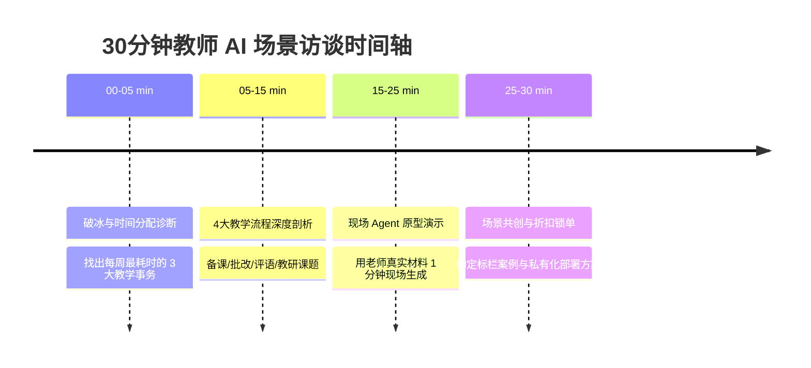

# 🍎 昆仑增长·“AI 助教数字大脑”30分钟教师深度访谈手册 SOP

> **适用对象**：中小学教师、高校讲师、教研组长、培训机构校长/教学负责人  
> **访谈目标**：用 30 分钟精细化诊断教学工作痛点，现场演示 Agent 场景，锁定共创标杆案例与私有化部署订单。

---

## 📦 一、 访谈前准备清单 (Pre-interview Checklist)

### 1.1 提示老师提前准备的资料（任选 2-3 样即可）
- 📄 **近期教案/备课笔记**（了解备课习惯与格式）；
- 📝 **班级试卷/学生错题样例**（用于现场测试 AI 错题归纳与解析）；
- 💬 **期末学生评语/家长通知模板**（用于测试 AI 评语自动生成）；
- 📊 **教研组汇报/课题申报材料**（针对高校/教研组长）。

### 2.2 大帅 (Marshall) 准备的演示工具箱
- 💻 **KGOS 智能错题本系统** (`math_wrong_notebook_web` 演示 Demo)；
- 🤖 **通用 AI 助教数字大脑 Agent** (含 RAG 知识库与一键评语生成)；
- 📜 **软著/专利自动生成器** (`SoftwareCopyright-Skill`，针对高校教师/课题组)。

---

## ⏱️ 二、 30分钟访谈时间轴与金牌问题表



---

### 🎙️ 阶段一：破冰与时间分配诊断 (00 - 05 Min)

**🎯 目标**：建立专业信任，算出老师每周被重复劳动浪费的时间。

* **开场金句**：
  > “X老师您好！我们最近在跟多位优秀教师做 AI 场景共创。很多老师反映，现在每天除了上课，大量时间都被备课、改作业、写评语这些事务性工作占满了。今天咱们聊 30 分钟，就是帮您算算哪些工作可以用 AI ‘数字助教’来代劳，让您把时间还给教学和生活。”

* **提问清单**：
  1. “您每周在教学之外（备课、改作业、写总结、家校沟通）大约要花多少小时？”
  2. “如果选出 **最繁重、最想甩给 AI 做的两件事**，您会选哪两件？”

---

### 🔍 阶段二：4 大教学核心流程深度剖析 (05 - 15 Min)

#### 1. 备课与教案生成 (Lesson Planning)
- **诊断提问**：“您平时备一份新课教案需要多久？查找教学素材/PPT 最头疼的是什么？”
- **AI 落地切入点**：输入教学大纲，AI 3 秒生成差异化分层教案（基础版/进阶版/拔高版）。

#### 2. 批改作业与错题归纳 (Grading & Wrong Questions)
- **诊断提问**：“班里几十个学生的错题平时是怎么收集整理的？期末给学生做个性化复习资料难不难？”
- **AI 落地切入点**：拍照/扫描自动识别错题，自动匹配同类变式题，一键导出个人专属错题本 PDF。

#### 3. 学生评语与家校沟通 (Student Evaluation & Communication)
- **诊断提问**：“期末/月考后给几十个学生写定制化评语、跟家长发沟通反馈，要花几天时间？”
- **AI 落地切入点**：勾选学生特点（如：数学有进步、课堂偶尔走神），AI 自动生成尊贵、体贴、个性化的 300 字家长沟通评语。

#### 4. 课题/论文/软著申报（针对高校/组长）(Research & IP)
- **诊断提问**：“您每年有科研/课题申报或教改软著专利的需求吗？撰写材料繁琐吗？”
- **AI 落地切入点**：输入课题名称与教学代码，AI 自动生成全套软著申请材料与专利交底书。

---

### 🖥️ 阶段三：现场 Agent 原型演示 (15 - 25 Min)

**🎯 目标**：用老师带来的真实材料，现场演示 10 秒出结果，让老师产生“震撼感 (WOW Effect)”！

* **演示动作 1**：将老师拿来的学生错题照片/文本，放入 `math_wrong_notebook_web` 演示系统，1 秒识别考点并生成变式题；
* **演示动作 2**：输入“张同学，数学 85 分，平时逻辑强但计算粗心”，1 秒生成 3 种不同语气的家长沟通评语；
* **演示动作 3**：展示“AI 助教数字大脑”如何 24 小时回答学生课后疑问。

---

### 🤝 阶段四：场景共创与折扣锁单 (25 - 30 Min)

**🎯 目标**：确定共创意向，锁定特惠价格。

* **收尾金句**：
  > “X老师，结合咱们刚才聊的，您的 **[写评语/整理错题/备课]** 最适合做成您的专属‘AI 数字助教’。
  > 我们昆仑增长目前在打造 **【100 行业/教育标杆案例计划】**。如果您愿意把这个场景作为我们的联合宣发标杆：
  > 1. 我们免费为您设计整套《教师 AI 降本增效方案》；
  > 2. 您的专属 AI 数字大脑私有化部署，直接享受 **共创首批 5 折特惠**；
  > 3. 以后您所在学校/教研组其他老师引入，您作为共创体验官享受收益推荐赋能！”

---

## 📄 三、 访谈后 24 小时交付物模板

访谈结束后，24 小时内向老师/学校提交一份 PDF 格式的 **《XX 老师/学校 AI 数字助教实施路线图》**：

```markdown
# 🍎 [XX学校/老师] AI 数字助教定制实施路线图

### 1. 现状诊断
- 当前每周非教学耗时：18 小时
- 最大痛点：重复撰写期末评语、手动整理学生错题集

### 2. AI 数字大脑解决方案
- 模块 A：智能错题归纳与变式题生成器 (预计节省 60% 批改耗时)
- 模块 B：个性化家校沟通与评语生成 Agent (预计节省 80% 撰写耗时)
- 模块 C：教研课题与软著自动化工具

### 3. 部署与共创协议
- 交付周期：3-5 工作日
- 共创特惠价：[首批标杆折扣价]
```
