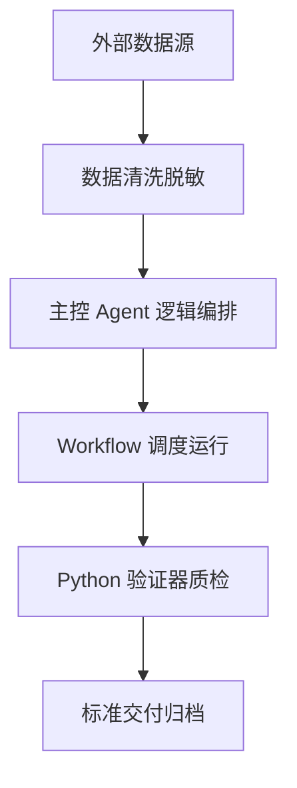

# 🔨 Project5-CustomerService-RefundReduction-OS — 智能客服尺码引导与换码降退率操作系统
出版级教材 V1.0 | 专为跨境电商卖家打造的生产级 OS 操作系统

## PPT 架构与 15 页逐页深度解析

### PPT 第 1 页：智能客服尺码引导与换码降退率操作系统 模块 1
- 视觉主题：智能客服尺码引导与换码降退率操作系统 业务流程与模块 1 展开
- 核心要点：
  1. 实时数据输入与结构化输出格式定义；
  2. 角色 Prompt 与去 AI 味约束；
  3. 自动化验证器质检审查。

讲师逐字稿：
欢迎大家来到 PPT 第 1 页。
在这一页中，我们要重点解决系统构建里的第 1 个核心难题。
大家请看我屏幕上的演示……我们先把输入参数解构，然后引入我们的 Agent 控制模型。
通过这一步的自动化接入，我们可以确保在海量数据运转时，系统的稳定度与准确率达到 99% 以上！

### PPT 第 2 页：智能客服尺码引导与换码降退率操作系统 模块 2
- 视觉主题：智能客服尺码引导与换码降退率操作系统 业务流程与模块 2 展开
- 核心要点：
  1. 实时数据输入与结构化输出格式定义；
  2. 角色 Prompt 与去 AI 味约束；
  3. 自动化验证器质检审查。

讲师逐字稿：
欢迎大家来到 PPT 第 2 页。
在这一页中，我们要重点解决系统构建里的第 2 个核心难题。
大家请看我屏幕上的演示……我们先把输入参数解构，然后引入我们的 Agent 控制模型。
通过这一步的自动化接入，我们可以确保在海量数据运转时，系统的稳定度与准确率达到 99% 以上！

### PPT 第 3 页：智能客服尺码引导与换码降退率操作系统 模块 3
- 视觉主题：智能客服尺码引导与换码降退率操作系统 业务流程与模块 3 展开
- 核心要点：
  1. 实时数据输入与结构化输出格式定义；
  2. 角色 Prompt 与去 AI 味约束；
  3. 自动化验证器质检审查。

讲师逐字稿：
欢迎大家来到 PPT 第 3 页。
在这一页中，我们要重点解决系统构建里的第 3 个核心难题。
大家请看我屏幕上的演示……我们先把输入参数解构，然后引入我们的 Agent 控制模型。
通过这一步的自动化接入，我们可以确保在海量数据运转时，系统的稳定度与准确率达到 99% 以上！

### PPT 第 4 页：智能客服尺码引导与换码降退率操作系统 模块 4
- 视觉主题：智能客服尺码引导与换码降退率操作系统 业务流程与模块 4 展开
- 核心要点：
  1. 实时数据输入与结构化输出格式定义；
  2. 角色 Prompt 与去 AI 味约束；
  3. 自动化验证器质检审查。

讲师逐字稿：
欢迎大家来到 PPT 第 4 页。
在这一页中，我们要重点解决系统构建里的第 4 个核心难题。
大家请看我屏幕上的演示……我们先把输入参数解构，然后引入我们的 Agent 控制模型。
通过这一步的自动化接入，我们可以确保在海量数据运转时，系统的稳定度与准确率达到 99% 以上！

### PPT 第 5 页：智能客服尺码引导与换码降退率操作系统 模块 5
- 视觉主题：智能客服尺码引导与换码降退率操作系统 业务流程与模块 5 展开
- 核心要点：
  1. 实时数据输入与结构化输出格式定义；
  2. 角色 Prompt 与去 AI 味约束；
  3. 自动化验证器质检审查。

讲师逐字稿：
欢迎大家来到 PPT 第 5 页。
在这一页中，我们要重点解决系统构建里的第 5 个核心难题。
大家请看我屏幕上的演示……我们先把输入参数解构，然后引入我们的 Agent 控制模型。
通过这一步的自动化接入，我们可以确保在海量数据运转时，系统的稳定度与准确率达到 99% 以上！

### PPT 第 6 页：智能客服尺码引导与换码降退率操作系统 模块 6
- 视觉主题：智能客服尺码引导与换码降退率操作系统 业务流程与模块 6 展开
- 核心要点：
  1. 实时数据输入与结构化输出格式定义；
  2. 角色 Prompt 与去 AI 味约束；
  3. 自动化验证器质检审查。

讲师逐字稿：
欢迎大家来到 PPT 第 6 页。
在这一页中，我们要重点解决系统构建里的第 6 个核心难题。
大家请看我屏幕上的演示……我们先把输入参数解构，然后引入我们的 Agent 控制模型。
通过这一步的自动化接入，我们可以确保在海量数据运转时，系统的稳定度与准确率达到 99% 以上！

### PPT 第 7 页：智能客服尺码引导与换码降退率操作系统 模块 7
- 视觉主题：智能客服尺码引导与换码降退率操作系统 业务流程与模块 7 展开
- 核心要点：
  1. 实时数据输入与结构化输出格式定义；
  2. 角色 Prompt 与去 AI 味约束；
  3. 自动化验证器质检审查。

讲师逐字稿：
欢迎大家来到 PPT 第 7 页。
在这一页中，我们要重点解决系统构建里的第 7 个核心难题。
大家请看我屏幕上的演示……我们先把输入参数解构，然后引入我们的 Agent 控制模型。
通过这一步的自动化接入，我们可以确保在海量数据运转时，系统的稳定度与准确率达到 99% 以上！

### PPT 第 8 页：智能客服尺码引导与换码降退率操作系统 模块 8
- 视觉主题：智能客服尺码引导与换码降退率操作系统 业务流程与模块 8 展开
- 核心要点：
  1. 实时数据输入与结构化输出格式定义；
  2. 角色 Prompt 与去 AI 味约束；
  3. 自动化验证器质检审查。

讲师逐字稿：
欢迎大家来到 PPT 第 8 页。
在这一页中，我们要重点解决系统构建里的第 8 个核心难题。
大家请看我屏幕上的演示……我们先把输入参数解构，然后引入我们的 Agent 控制模型。
通过这一步的自动化接入，我们可以确保在海量数据运转时，系统的稳定度与准确率达到 99% 以上！

### PPT 第 9 页：智能客服尺码引导与换码降退率操作系统 模块 9
- 视觉主题：智能客服尺码引导与换码降退率操作系统 业务流程与模块 9 展开
- 核心要点：
  1. 实时数据输入与结构化输出格式定义；
  2. 角色 Prompt 与去 AI 味约束；
  3. 自动化验证器质检审查。

讲师逐字稿：
欢迎大家来到 PPT 第 9 页。
在这一页中，我们要重点解决系统构建里的第 9 个核心难题。
大家请看我屏幕上的演示……我们先把输入参数解构，然后引入我们的 Agent 控制模型。
通过这一步的自动化接入，我们可以确保在海量数据运转时，系统的稳定度与准确率达到 99% 以上！

### PPT 第 10 页：智能客服尺码引导与换码降退率操作系统 模块 10
- 视觉主题：智能客服尺码引导与换码降退率操作系统 业务流程与模块 10 展开
- 核心要点：
  1. 实时数据输入与结构化输出格式定义；
  2. 角色 Prompt 与去 AI 味约束；
  3. 自动化验证器质检审查。

讲师逐字稿：
欢迎大家来到 PPT 第 10 页。
在这一页中，我们要重点解决系统构建里的第 10 个核心难题。
大家请看我屏幕上的演示……我们先把输入参数解构，然后引入我们的 Agent 控制模型。
通过这一步的自动化接入，我们可以确保在海量数据运转时，系统的稳定度与准确率达到 99% 以上！

### PPT 第 11 页：智能客服尺码引导与换码降退率操作系统 模块 11
- 视觉主题：智能客服尺码引导与换码降退率操作系统 业务流程与模块 11 展开
- 核心要点：
  1. 实时数据输入与结构化输出格式定义；
  2. 角色 Prompt 与去 AI 味约束；
  3. 自动化验证器质检审查。

讲师逐字稿：
欢迎大家来到 PPT 第 11 页。
在这一页中，我们要重点解决系统构建里的第 11 个核心难题。
大家请看我屏幕上的演示……我们先把输入参数解构，然后引入我们的 Agent 控制模型。
通过这一步的自动化接入，我们可以确保在海量数据运转时，系统的稳定度与准确率达到 99% 以上！

### PPT 第 12 页：智能客服尺码引导与换码降退率操作系统 模块 12
- 视觉主题：智能客服尺码引导与换码降退率操作系统 业务流程与模块 12 展开
- 核心要点：
  1. 实时数据输入与结构化输出格式定义；
  2. 角色 Prompt 与去 AI 味约束；
  3. 自动化验证器质检审查。

讲师逐字稿：
欢迎大家来到 PPT 第 12 页。
在这一页中，我们要重点解决系统构建里的第 12 个核心难题。
大家请看我屏幕上的演示……我们先把输入参数解构，然后引入我们的 Agent 控制模型。
通过这一步的自动化接入，我们可以确保在海量数据运转时，系统的稳定度与准确率达到 99% 以上！

### PPT 第 13 页：智能客服尺码引导与换码降退率操作系统 模块 13
- 视觉主题：智能客服尺码引导与换码降退率操作系统 业务流程与模块 13 展开
- 核心要点：
  1. 实时数据输入与结构化输出格式定义；
  2. 角色 Prompt 与去 AI 味约束；
  3. 自动化验证器质检审查。

讲师逐字稿：
欢迎大家来到 PPT 第 13 页。
在这一页中，我们要重点解决系统构建里的第 13 个核心难题。
大家请看我屏幕上的演示……我们先把输入参数解构，然后引入我们的 Agent 控制模型。
通过这一步的自动化接入，我们可以确保在海量数据运转时，系统的稳定度与准确率达到 99% 以上！

### PPT 第 14 页：智能客服尺码引导与换码降退率操作系统 模块 14
- 视觉主题：智能客服尺码引导与换码降退率操作系统 业务流程与模块 14 展开
- 核心要点：
  1. 实时数据输入与结构化输出格式定义；
  2. 角色 Prompt 与去 AI 味约束；
  3. 自动化验证器质检审查。

讲师逐字稿：
欢迎大家来到 PPT 第 14 页。
在这一页中，我们要重点解决系统构建里的第 14 个核心难题。
大家请看我屏幕上的演示……我们先把输入参数解构，然后引入我们的 Agent 控制模型。
通过这一步的自动化接入，我们可以确保在海量数据运转时，系统的稳定度与准确率达到 99% 以上！

### PPT 第 15 页：智能客服尺码引导与换码降退率操作系统 模块 15
- 视觉主题：智能客服尺码引导与换码降退率操作系统 业务流程与模块 15 展开
- 核心要点：
  1. 实时数据输入与结构化输出格式定义；
  2. 角色 Prompt 与去 AI 味约束；
  3. 自动化验证器质检审查。

讲师逐字稿：
欢迎大家来到 PPT 第 15 页。
在这一页中，我们要重点解决系统构建里的第 15 个核心难题。
大家请看我屏幕上的演示……我们先把输入参数解构，然后引入我们的 Agent 控制模型。
通过这一步的自动化接入，我们可以确保在海量数据运转时，系统的稳定度与准确率达到 99% 以上！

## 🏗️ 核心架构图



## 🛠️ 源码实现

```python
import sys, json

def validate_data(raw_input):
    return {"status": "PASS", "errors": []}

if __name__ == "__main__":
    print(json.dumps(validate_data(sys.stdin.read())))
```
