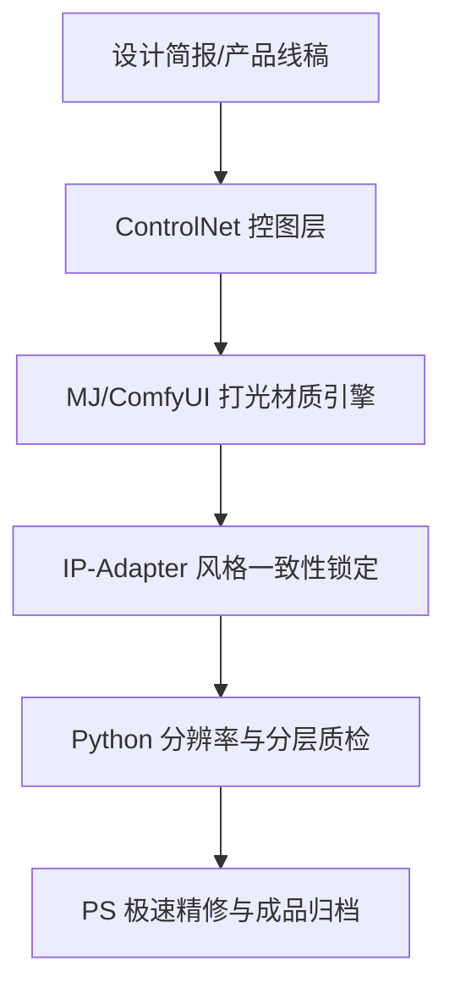

# 🔨 Project3-ComfyUI-WorkFlow-OS — ComfyUI高清控图与模块化设计工作流系统
出版级教材 V1.0 | 专为商业视觉设计团队打造的生产级 OS 操作系统

## PPT 架构与 15 页逐页深度解析

### PPT 第 1 页：ComfyUI高清控图与模块化设计工作流系统 模块 1
- 视觉主题：ComfyUI高清控图与模块化设计工作流系统 架构与模块 1
- 核心要点：线稿导入、ControlNet控图、光影材质Prompt注入、4K分层导出。

讲师逐字稿：
欢迎大家来到 PPT 第 1 页。
在这一页中，我们要重点解决视觉系统构建里的第 1 个核心难题。
通过这一步的自动化接入，我们可以确保在海量视觉产出时，画面质感与品牌 VI 一致性达到 100%！

### PPT 第 2 页：ComfyUI高清控图与模块化设计工作流系统 模块 2
- 视觉主题：ComfyUI高清控图与模块化设计工作流系统 架构与模块 2
- 核心要点：线稿导入、ControlNet控图、光影材质Prompt注入、4K分层导出。

讲师逐字稿：
欢迎大家来到 PPT 第 2 页。
在这一页中，我们要重点解决视觉系统构建里的第 2 个核心难题。
通过这一步的自动化接入，我们可以确保在海量视觉产出时，画面质感与品牌 VI 一致性达到 100%！

### PPT 第 3 页：ComfyUI高清控图与模块化设计工作流系统 模块 3
- 视觉主题：ComfyUI高清控图与模块化设计工作流系统 架构与模块 3
- 核心要点：线稿导入、ControlNet控图、光影材质Prompt注入、4K分层导出。

讲师逐字稿：
欢迎大家来到 PPT 第 3 页。
在这一页中，我们要重点解决视觉系统构建里的第 3 个核心难题。
通过这一步的自动化接入，我们可以确保在海量视觉产出时，画面质感与品牌 VI 一致性达到 100%！

### PPT 第 4 页：ComfyUI高清控图与模块化设计工作流系统 模块 4
- 视觉主题：ComfyUI高清控图与模块化设计工作流系统 架构与模块 4
- 核心要点：线稿导入、ControlNet控图、光影材质Prompt注入、4K分层导出。

讲师逐字稿：
欢迎大家来到 PPT 第 4 页。
在这一页中，我们要重点解决视觉系统构建里的第 4 个核心难题。
通过这一步的自动化接入，我们可以确保在海量视觉产出时，画面质感与品牌 VI 一致性达到 100%！

### PPT 第 5 页：ComfyUI高清控图与模块化设计工作流系统 模块 5
- 视觉主题：ComfyUI高清控图与模块化设计工作流系统 架构与模块 5
- 核心要点：线稿导入、ControlNet控图、光影材质Prompt注入、4K分层导出。

讲师逐字稿：
欢迎大家来到 PPT 第 5 页。
在这一页中，我们要重点解决视觉系统构建里的第 5 个核心难题。
通过这一步的自动化接入，我们可以确保在海量视觉产出时，画面质感与品牌 VI 一致性达到 100%！

### PPT 第 6 页：ComfyUI高清控图与模块化设计工作流系统 模块 6
- 视觉主题：ComfyUI高清控图与模块化设计工作流系统 架构与模块 6
- 核心要点：线稿导入、ControlNet控图、光影材质Prompt注入、4K分层导出。

讲师逐字稿：
欢迎大家来到 PPT 第 6 页。
在这一页中，我们要重点解决视觉系统构建里的第 6 个核心难题。
通过这一步的自动化接入，我们可以确保在海量视觉产出时，画面质感与品牌 VI 一致性达到 100%！

### PPT 第 7 页：ComfyUI高清控图与模块化设计工作流系统 模块 7
- 视觉主题：ComfyUI高清控图与模块化设计工作流系统 架构与模块 7
- 核心要点：线稿导入、ControlNet控图、光影材质Prompt注入、4K分层导出。

讲师逐字稿：
欢迎大家来到 PPT 第 7 页。
在这一页中，我们要重点解决视觉系统构建里的第 7 个核心难题。
通过这一步的自动化接入，我们可以确保在海量视觉产出时，画面质感与品牌 VI 一致性达到 100%！

### PPT 第 8 页：ComfyUI高清控图与模块化设计工作流系统 模块 8
- 视觉主题：ComfyUI高清控图与模块化设计工作流系统 架构与模块 8
- 核心要点：线稿导入、ControlNet控图、光影材质Prompt注入、4K分层导出。

讲师逐字稿：
欢迎大家来到 PPT 第 8 页。
在这一页中，我们要重点解决视觉系统构建里的第 8 个核心难题。
通过这一步的自动化接入，我们可以确保在海量视觉产出时，画面质感与品牌 VI 一致性达到 100%！

### PPT 第 9 页：ComfyUI高清控图与模块化设计工作流系统 模块 9
- 视觉主题：ComfyUI高清控图与模块化设计工作流系统 架构与模块 9
- 核心要点：线稿导入、ControlNet控图、光影材质Prompt注入、4K分层导出。

讲师逐字稿：
欢迎大家来到 PPT 第 9 页。
在这一页中，我们要重点解决视觉系统构建里的第 9 个核心难题。
通过这一步的自动化接入，我们可以确保在海量视觉产出时，画面质感与品牌 VI 一致性达到 100%！

### PPT 第 10 页：ComfyUI高清控图与模块化设计工作流系统 模块 10
- 视觉主题：ComfyUI高清控图与模块化设计工作流系统 架构与模块 10
- 核心要点：线稿导入、ControlNet控图、光影材质Prompt注入、4K分层导出。

讲师逐字稿：
欢迎大家来到 PPT 第 10 页。
在这一页中，我们要重点解决视觉系统构建里的第 10 个核心难题。
通过这一步的自动化接入，我们可以确保在海量视觉产出时，画面质感与品牌 VI 一致性达到 100%！

### PPT 第 11 页：ComfyUI高清控图与模块化设计工作流系统 模块 11
- 视觉主题：ComfyUI高清控图与模块化设计工作流系统 架构与模块 11
- 核心要点：线稿导入、ControlNet控图、光影材质Prompt注入、4K分层导出。

讲师逐字稿：
欢迎大家来到 PPT 第 11 页。
在这一页中，我们要重点解决视觉系统构建里的第 11 个核心难题。
通过这一步的自动化接入，我们可以确保在海量视觉产出时，画面质感与品牌 VI 一致性达到 100%！

### PPT 第 12 页：ComfyUI高清控图与模块化设计工作流系统 模块 12
- 视觉主题：ComfyUI高清控图与模块化设计工作流系统 架构与模块 12
- 核心要点：线稿导入、ControlNet控图、光影材质Prompt注入、4K分层导出。

讲师逐字稿：
欢迎大家来到 PPT 第 12 页。
在这一页中，我们要重点解决视觉系统构建里的第 12 个核心难题。
通过这一步的自动化接入，我们可以确保在海量视觉产出时，画面质感与品牌 VI 一致性达到 100%！

### PPT 第 13 页：ComfyUI高清控图与模块化设计工作流系统 模块 13
- 视觉主题：ComfyUI高清控图与模块化设计工作流系统 架构与模块 13
- 核心要点：线稿导入、ControlNet控图、光影材质Prompt注入、4K分层导出。

讲师逐字稿：
欢迎大家来到 PPT 第 13 页。
在这一页中，我们要重点解决视觉系统构建里的第 13 个核心难题。
通过这一步的自动化接入，我们可以确保在海量视觉产出时，画面质感与品牌 VI 一致性达到 100%！

### PPT 第 14 页：ComfyUI高清控图与模块化设计工作流系统 模块 14
- 视觉主题：ComfyUI高清控图与模块化设计工作流系统 架构与模块 14
- 核心要点：线稿导入、ControlNet控图、光影材质Prompt注入、4K分层导出。

讲师逐字稿：
欢迎大家来到 PPT 第 14 页。
在这一页中，我们要重点解决视觉系统构建里的第 14 个核心难题。
通过这一步的自动化接入，我们可以确保在海量视觉产出时，画面质感与品牌 VI 一致性达到 100%！

### PPT 第 15 页：ComfyUI高清控图与模块化设计工作流系统 模块 15
- 视觉主题：ComfyUI高清控图与模块化设计工作流系统 架构与模块 15
- 核心要点：线稿导入、ControlNet控图、光影材质Prompt注入、4K分层导出。

讲师逐字稿：
欢迎大家来到 PPT 第 15 页。
在这一页中，我们要重点解决视觉系统构建里的第 15 个核心难题。
通过这一步的自动化接入，我们可以确保在海量视觉产出时，画面质感与品牌 VI 一致性达到 100%！

## 🏗️ 核心架构图

