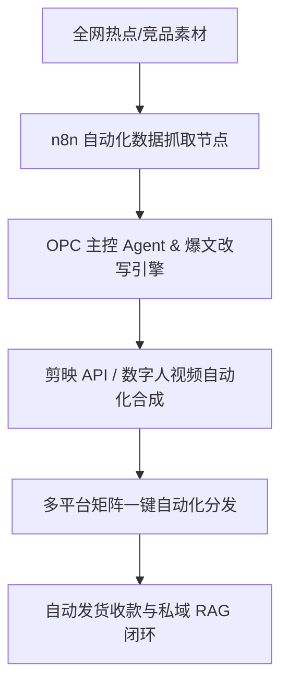

# 🔨 Project5-GlobalHotspots-AutoRewrite-OS — 全网热点抓取与自动改写洗稿爆文系统
出版级教材 V1.0 | 专为超级个体与 OPC 架构师打造的生产级 OS 操作系统

## PPT 架构与 15 页逐页深度解析

### PPT 第 1 页：全网热点抓取与自动改写洗稿爆文系统 模块 1
- 视觉主题：全网热点抓取与自动改写洗稿爆文系统 OPC架构与模块 1
- 核心要点：n8n节点配置、Agent岗位说明书、无人值守自动化、风控频次避让。

讲师逐字稿：
欢迎大家来到 PPT 第 1 页。
在这一页中，我们要重点解决超级个体系统构建里的第 1 个核心难题。
通过这一步的自动化接入，我们可以确保你一个人能够轻松管理 10 多个平台的数字资产，实现 24 小时无人值守商业自动运转！

### PPT 第 2 页：全网热点抓取与自动改写洗稿爆文系统 模块 2
- 视觉主题：全网热点抓取与自动改写洗稿爆文系统 OPC架构与模块 2
- 核心要点：n8n节点配置、Agent岗位说明书、无人值守自动化、风控频次避让。

讲师逐字稿：
欢迎大家来到 PPT 第 2 页。
在这一页中，我们要重点解决超级个体系统构建里的第 2 个核心难题。
通过这一步的自动化接入，我们可以确保你一个人能够轻松管理 10 多个平台的数字资产，实现 24 小时无人值守商业自动运转！

### PPT 第 3 页：全网热点抓取与自动改写洗稿爆文系统 模块 3
- 视觉主题：全网热点抓取与自动改写洗稿爆文系统 OPC架构与模块 3
- 核心要点：n8n节点配置、Agent岗位说明书、无人值守自动化、风控频次避让。

讲师逐字稿：
欢迎大家来到 PPT 第 3 页。
在这一页中，我们要重点解决超级个体系统构建里的第 3 个核心难题。
通过这一步的自动化接入，我们可以确保你一个人能够轻松管理 10 多个平台的数字资产，实现 24 小时无人值守商业自动运转！

### PPT 第 4 页：全网热点抓取与自动改写洗稿爆文系统 模块 4
- 视觉主题：全网热点抓取与自动改写洗稿爆文系统 OPC架构与模块 4
- 核心要点：n8n节点配置、Agent岗位说明书、无人值守自动化、风控频次避让。

讲师逐字稿：
欢迎大家来到 PPT 第 4 页。
在这一页中，我们要重点解决超级个体系统构建里的第 4 个核心难题。
通过这一步的自动化接入，我们可以确保你一个人能够轻松管理 10 多个平台的数字资产，实现 24 小时无人值守商业自动运转！

### PPT 第 5 页：全网热点抓取与自动改写洗稿爆文系统 模块 5
- 视觉主题：全网热点抓取与自动改写洗稿爆文系统 OPC架构与模块 5
- 核心要点：n8n节点配置、Agent岗位说明书、无人值守自动化、风控频次避让。

讲师逐字稿：
欢迎大家来到 PPT 第 5 页。
在这一页中，我们要重点解决超级个体系统构建里的第 5 个核心难题。
通过这一步的自动化接入，我们可以确保你一个人能够轻松管理 10 多个平台的数字资产，实现 24 小时无人值守商业自动运转！

### PPT 第 6 页：全网热点抓取与自动改写洗稿爆文系统 模块 6
- 视觉主题：全网热点抓取与自动改写洗稿爆文系统 OPC架构与模块 6
- 核心要点：n8n节点配置、Agent岗位说明书、无人值守自动化、风控频次避让。

讲师逐字稿：
欢迎大家来到 PPT 第 6 页。
在这一页中，我们要重点解决超级个体系统构建里的第 6 个核心难题。
通过这一步的自动化接入，我们可以确保你一个人能够轻松管理 10 多个平台的数字资产，实现 24 小时无人值守商业自动运转！

### PPT 第 7 页：全网热点抓取与自动改写洗稿爆文系统 模块 7
- 视觉主题：全网热点抓取与自动改写洗稿爆文系统 OPC架构与模块 7
- 核心要点：n8n节点配置、Agent岗位说明书、无人值守自动化、风控频次避让。

讲师逐字稿：
欢迎大家来到 PPT 第 7 页。
在这一页中，我们要重点解决超级个体系统构建里的第 7 个核心难题。
通过这一步的自动化接入，我们可以确保你一个人能够轻松管理 10 多个平台的数字资产，实现 24 小时无人值守商业自动运转！

### PPT 第 8 页：全网热点抓取与自动改写洗稿爆文系统 模块 8
- 视觉主题：全网热点抓取与自动改写洗稿爆文系统 OPC架构与模块 8
- 核心要点：n8n节点配置、Agent岗位说明书、无人值守自动化、风控频次避让。

讲师逐字稿：
欢迎大家来到 PPT 第 8 页。
在这一页中，我们要重点解决超级个体系统构建里的第 8 个核心难题。
通过这一步的自动化接入，我们可以确保你一个人能够轻松管理 10 多个平台的数字资产，实现 24 小时无人值守商业自动运转！

### PPT 第 9 页：全网热点抓取与自动改写洗稿爆文系统 模块 9
- 视觉主题：全网热点抓取与自动改写洗稿爆文系统 OPC架构与模块 9
- 核心要点：n8n节点配置、Agent岗位说明书、无人值守自动化、风控频次避让。

讲师逐字稿：
欢迎大家来到 PPT 第 9 页。
在这一页中，我们要重点解决超级个体系统构建里的第 9 个核心难题。
通过这一步的自动化接入，我们可以确保你一个人能够轻松管理 10 多个平台的数字资产，实现 24 小时无人值守商业自动运转！

### PPT 第 10 页：全网热点抓取与自动改写洗稿爆文系统 模块 10
- 视觉主题：全网热点抓取与自动改写洗稿爆文系统 OPC架构与模块 10
- 核心要点：n8n节点配置、Agent岗位说明书、无人值守自动化、风控频次避让。

讲师逐字稿：
欢迎大家来到 PPT 第 10 页。
在这一页中，我们要重点解决超级个体系统构建里的第 10 个核心难题。
通过这一步的自动化接入，我们可以确保你一个人能够轻松管理 10 多个平台的数字资产，实现 24 小时无人值守商业自动运转！

### PPT 第 11 页：全网热点抓取与自动改写洗稿爆文系统 模块 11
- 视觉主题：全网热点抓取与自动改写洗稿爆文系统 OPC架构与模块 11
- 核心要点：n8n节点配置、Agent岗位说明书、无人值守自动化、风控频次避让。

讲师逐字稿：
欢迎大家来到 PPT 第 11 页。
在这一页中，我们要重点解决超级个体系统构建里的第 11 个核心难题。
通过这一步的自动化接入，我们可以确保你一个人能够轻松管理 10 多个平台的数字资产，实现 24 小时无人值守商业自动运转！

### PPT 第 12 页：全网热点抓取与自动改写洗稿爆文系统 模块 12
- 视觉主题：全网热点抓取与自动改写洗稿爆文系统 OPC架构与模块 12
- 核心要点：n8n节点配置、Agent岗位说明书、无人值守自动化、风控频次避让。

讲师逐字稿：
欢迎大家来到 PPT 第 12 页。
在这一页中，我们要重点解决超级个体系统构建里的第 12 个核心难题。
通过这一步的自动化接入，我们可以确保你一个人能够轻松管理 10 多个平台的数字资产，实现 24 小时无人值守商业自动运转！

### PPT 第 13 页：全网热点抓取与自动改写洗稿爆文系统 模块 13
- 视觉主题：全网热点抓取与自动改写洗稿爆文系统 OPC架构与模块 13
- 核心要点：n8n节点配置、Agent岗位说明书、无人值守自动化、风控频次避让。

讲师逐字稿：
欢迎大家来到 PPT 第 13 页。
在这一页中，我们要重点解决超级个体系统构建里的第 13 个核心难题。
通过这一步的自动化接入，我们可以确保你一个人能够轻松管理 10 多个平台的数字资产，实现 24 小时无人值守商业自动运转！

### PPT 第 14 页：全网热点抓取与自动改写洗稿爆文系统 模块 14
- 视觉主题：全网热点抓取与自动改写洗稿爆文系统 OPC架构与模块 14
- 核心要点：n8n节点配置、Agent岗位说明书、无人值守自动化、风控频次避让。

讲师逐字稿：
欢迎大家来到 PPT 第 14 页。
在这一页中，我们要重点解决超级个体系统构建里的第 14 个核心难题。
通过这一步的自动化接入，我们可以确保你一个人能够轻松管理 10 多个平台的数字资产，实现 24 小时无人值守商业自动运转！

### PPT 第 15 页：全网热点抓取与自动改写洗稿爆文系统 模块 15
- 视觉主题：全网热点抓取与自动改写洗稿爆文系统 OPC架构与模块 15
- 核心要点：n8n节点配置、Agent岗位说明书、无人值守自动化、风控频次避让。

讲师逐字稿：
欢迎大家来到 PPT 第 15 页。
在这一页中，我们要重点解决超级个体系统构建里的第 15 个核心难题。
通过这一步的自动化接入，我们可以确保你一个人能够轻松管理 10 多个平台的数字资产，实现 24 小时无人值守商业自动运转！

## 🏗️ 核心架构图

