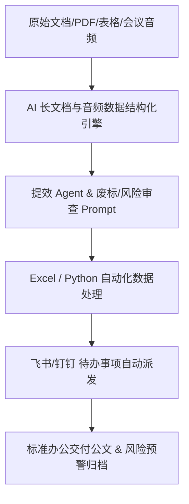

# 🔨 Project5-Contract-Risk-Scan-OS — 合同条款风险扫描与法律合规比对系统
出版级教材 V1.0 | 专为职场精英与办公团队打造的生产级 OS 操作系统

## PPT 架构与 15 页逐页深度解析

### PPT 第 1 页：合同条款风险扫描与法律合规比对系统 模块 1
- 视觉主题：合同条款风险扫描与法律合规比对系统 提效架构与模块 1
- 核心要点：长文档结构化解析、标书废标风控审查、Excel公式生成、合同风险自动核对。

讲师逐字稿：
欢迎大家来到 PPT 第 1 页。
在这一页中，我们要重点解决智能办公系统构建里的第 1 个核心难题。
通过这一步的自动化接入，我们可以确保全岗位在处理繁重事务性工作时，人效提升 10 倍，同时零漏洞防范商业风险！

### PPT 第 2 页：合同条款风险扫描与法律合规比对系统 模块 2
- 视觉主题：合同条款风险扫描与法律合规比对系统 提效架构与模块 2
- 核心要点：长文档结构化解析、标书废标风控审查、Excel公式生成、合同风险自动核对。

讲师逐字稿：
欢迎大家来到 PPT 第 2 页。
在这一页中，我们要重点解决智能办公系统构建里的第 2 个核心难题。
通过这一步的自动化接入，我们可以确保全岗位在处理繁重事务性工作时，人效提升 10 倍，同时零漏洞防范商业风险！

### PPT 第 3 页：合同条款风险扫描与法律合规比对系统 模块 3
- 视觉主题：合同条款风险扫描与法律合规比对系统 提效架构与模块 3
- 核心要点：长文档结构化解析、标书废标风控审查、Excel公式生成、合同风险自动核对。

讲师逐字稿：
欢迎大家来到 PPT 第 3 页。
在这一页中，我们要重点解决智能办公系统构建里的第 3 个核心难题。
通过这一步的自动化接入，我们可以确保全岗位在处理繁重事务性工作时，人效提升 10 倍，同时零漏洞防范商业风险！

### PPT 第 4 页：合同条款风险扫描与法律合规比对系统 模块 4
- 视觉主题：合同条款风险扫描与法律合规比对系统 提效架构与模块 4
- 核心要点：长文档结构化解析、标书废标风控审查、Excel公式生成、合同风险自动核对。

讲师逐字稿：
欢迎大家来到 PPT 第 4 页。
在这一页中，我们要重点解决智能办公系统构建里的第 4 个核心难题。
通过这一步的自动化接入，我们可以确保全岗位在处理繁重事务性工作时，人效提升 10 倍，同时零漏洞防范商业风险！

### PPT 第 5 页：合同条款风险扫描与法律合规比对系统 模块 5
- 视觉主题：合同条款风险扫描与法律合规比对系统 提效架构与模块 5
- 核心要点：长文档结构化解析、标书废标风控审查、Excel公式生成、合同风险自动核对。

讲师逐字稿：
欢迎大家来到 PPT 第 5 页。
在这一页中，我们要重点解决智能办公系统构建里的第 5 个核心难题。
通过这一步的自动化接入，我们可以确保全岗位在处理繁重事务性工作时，人效提升 10 倍，同时零漏洞防范商业风险！

### PPT 第 6 页：合同条款风险扫描与法律合规比对系统 模块 6
- 视觉主题：合同条款风险扫描与法律合规比对系统 提效架构与模块 6
- 核心要点：长文档结构化解析、标书废标风控审查、Excel公式生成、合同风险自动核对。

讲师逐字稿：
欢迎大家来到 PPT 第 6 页。
在这一页中，我们要重点解决智能办公系统构建里的第 6 个核心难题。
通过这一步的自动化接入，我们可以确保全岗位在处理繁重事务性工作时，人效提升 10 倍，同时零漏洞防范商业风险！

### PPT 第 7 页：合同条款风险扫描与法律合规比对系统 模块 7
- 视觉主题：合同条款风险扫描与法律合规比对系统 提效架构与模块 7
- 核心要点：长文档结构化解析、标书废标风控审查、Excel公式生成、合同风险自动核对。

讲师逐字稿：
欢迎大家来到 PPT 第 7 页。
在这一页中，我们要重点解决智能办公系统构建里的第 7 个核心难题。
通过这一步的自动化接入，我们可以确保全岗位在处理繁重事务性工作时，人效提升 10 倍，同时零漏洞防范商业风险！

### PPT 第 8 页：合同条款风险扫描与法律合规比对系统 模块 8
- 视觉主题：合同条款风险扫描与法律合规比对系统 提效架构与模块 8
- 核心要点：长文档结构化解析、标书废标风控审查、Excel公式生成、合同风险自动核对。

讲师逐字稿：
欢迎大家来到 PPT 第 8 页。
在这一页中，我们要重点解决智能办公系统构建里的第 8 个核心难题。
通过这一步的自动化接入，我们可以确保全岗位在处理繁重事务性工作时，人效提升 10 倍，同时零漏洞防范商业风险！

### PPT 第 9 页：合同条款风险扫描与法律合规比对系统 模块 9
- 视觉主题：合同条款风险扫描与法律合规比对系统 提效架构与模块 9
- 核心要点：长文档结构化解析、标书废标风控审查、Excel公式生成、合同风险自动核对。

讲师逐字稿：
欢迎大家来到 PPT 第 9 页。
在这一页中，我们要重点解决智能办公系统构建里的第 9 个核心难题。
通过这一步的自动化接入，我们可以确保全岗位在处理繁重事务性工作时，人效提升 10 倍，同时零漏洞防范商业风险！

### PPT 第 10 页：合同条款风险扫描与法律合规比对系统 模块 10
- 视觉主题：合同条款风险扫描与法律合规比对系统 提效架构与模块 10
- 核心要点：长文档结构化解析、标书废标风控审查、Excel公式生成、合同风险自动核对。

讲师逐字稿：
欢迎大家来到 PPT 第 10 页。
在这一页中，我们要重点解决智能办公系统构建里的第 10 个核心难题。
通过这一步的自动化接入，我们可以确保全岗位在处理繁重事务性工作时，人效提升 10 倍，同时零漏洞防范商业风险！

### PPT 第 11 页：合同条款风险扫描与法律合规比对系统 模块 11
- 视觉主题：合同条款风险扫描与法律合规比对系统 提效架构与模块 11
- 核心要点：长文档结构化解析、标书废标风控审查、Excel公式生成、合同风险自动核对。

讲师逐字稿：
欢迎大家来到 PPT 第 11 页。
在这一页中，我们要重点解决智能办公系统构建里的第 11 个核心难题。
通过这一步的自动化接入，我们可以确保全岗位在处理繁重事务性工作时，人效提升 10 倍，同时零漏洞防范商业风险！

### PPT 第 12 页：合同条款风险扫描与法律合规比对系统 模块 12
- 视觉主题：合同条款风险扫描与法律合规比对系统 提效架构与模块 12
- 核心要点：长文档结构化解析、标书废标风控审查、Excel公式生成、合同风险自动核对。

讲师逐字稿：
欢迎大家来到 PPT 第 12 页。
在这一页中，我们要重点解决智能办公系统构建里的第 12 个核心难题。
通过这一步的自动化接入，我们可以确保全岗位在处理繁重事务性工作时，人效提升 10 倍，同时零漏洞防范商业风险！

### PPT 第 13 页：合同条款风险扫描与法律合规比对系统 模块 13
- 视觉主题：合同条款风险扫描与法律合规比对系统 提效架构与模块 13
- 核心要点：长文档结构化解析、标书废标风控审查、Excel公式生成、合同风险自动核对。

讲师逐字稿：
欢迎大家来到 PPT 第 13 页。
在这一页中，我们要重点解决智能办公系统构建里的第 13 个核心难题。
通过这一步的自动化接入，我们可以确保全岗位在处理繁重事务性工作时，人效提升 10 倍，同时零漏洞防范商业风险！

### PPT 第 14 页：合同条款风险扫描与法律合规比对系统 模块 14
- 视觉主题：合同条款风险扫描与法律合规比对系统 提效架构与模块 14
- 核心要点：长文档结构化解析、标书废标风控审查、Excel公式生成、合同风险自动核对。

讲师逐字稿：
欢迎大家来到 PPT 第 14 页。
在这一页中，我们要重点解决智能办公系统构建里的第 14 个核心难题。
通过这一步的自动化接入，我们可以确保全岗位在处理繁重事务性工作时，人效提升 10 倍，同时零漏洞防范商业风险！

### PPT 第 15 页：合同条款风险扫描与法律合规比对系统 模块 15
- 视觉主题：合同条款风险扫描与法律合规比对系统 提效架构与模块 15
- 核心要点：长文档结构化解析、标书废标风控审查、Excel公式生成、合同风险自动核对。

讲师逐字稿：
欢迎大家来到 PPT 第 15 页。
在这一页中，我们要重点解决智能办公系统构建里的第 15 个核心难题。
通过这一步的自动化接入，我们可以确保全岗位在处理繁重事务性工作时，人效提升 10 倍，同时零漏洞防范商业风险！

## 🏗️ 核心架构图

