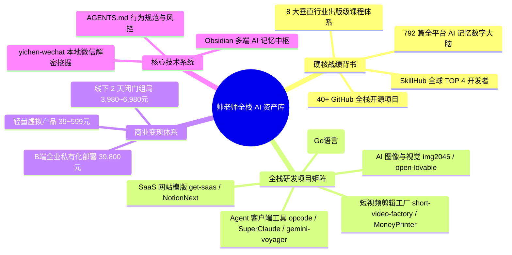

# 🗺️ 帅老师全栈 AI 开发者资产全景图谱 (Master Portfolio Map)

---

## 📌 资产摘要说明

- **项目托管**：[GitHub/Daseanle](https://github.com/Daseanle)
- **底层架构**：全量基于 Python, Node.js, Go, React, React Native 与 Mac 本地 SQLite/Gzip 解密。
- **全网声明**：所有项目与课程资产均为实打实研发、代码可查、真机可跑！

---

## 🔗 双向链接
- [[帅老师全量GitHub开源与网站项目矩阵]]
- [[02-个人真实经历与核心优势资产盘点]]
- [[帅老师真实背书与影响力爆破路线图]]
